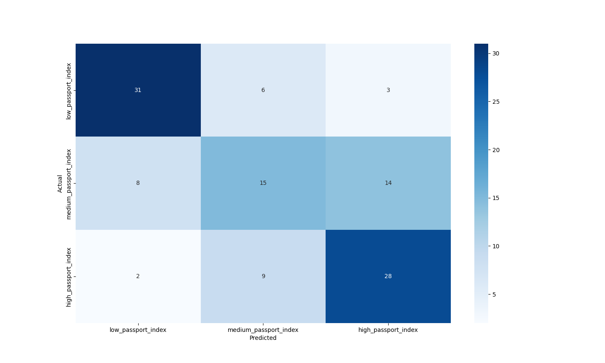
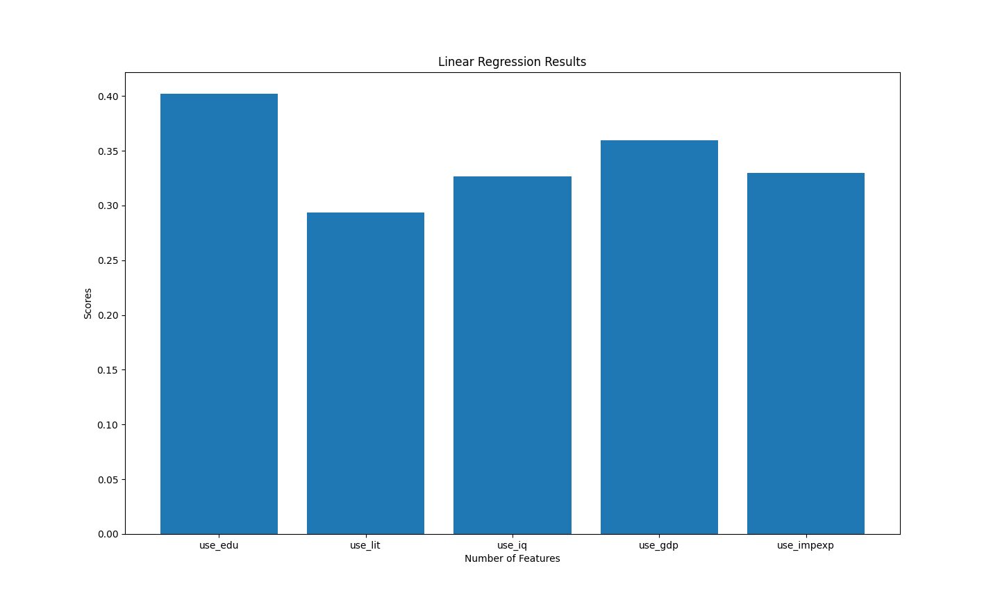
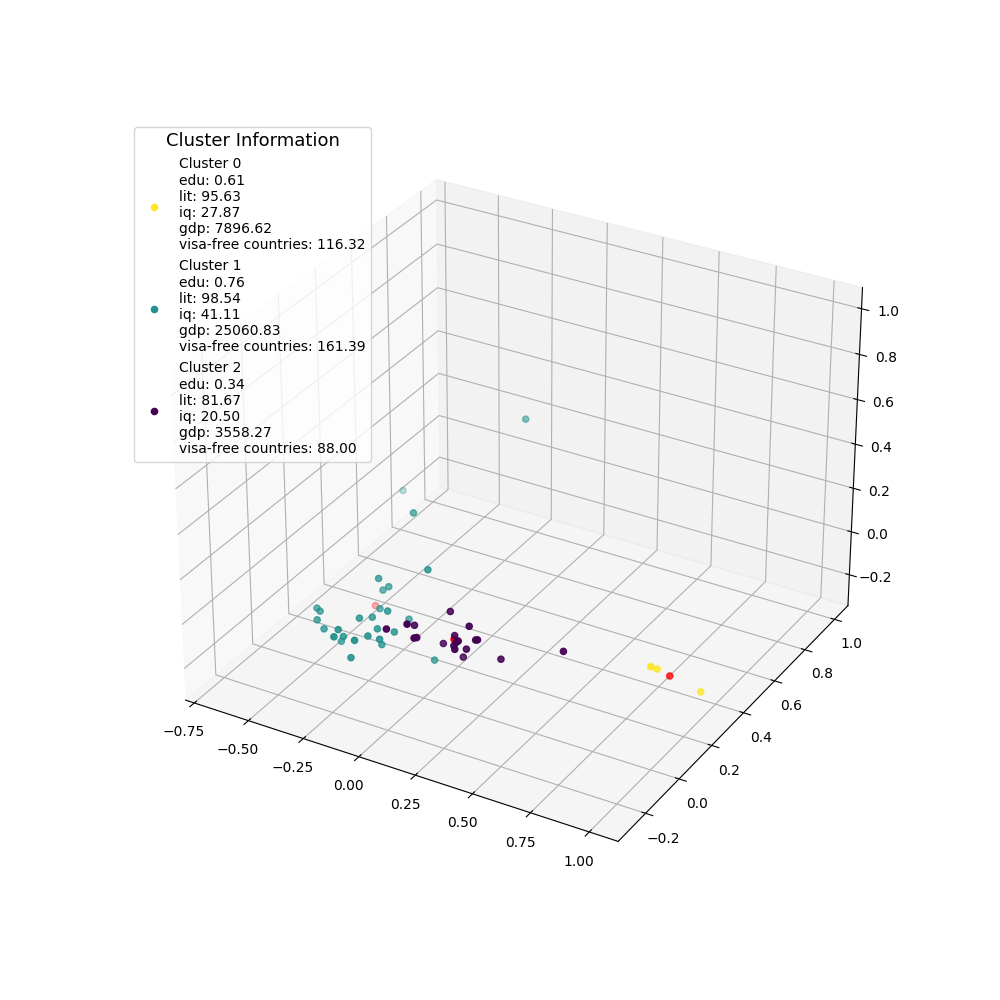

Logistic regression: 

We chose this representation because we wanted to test out how well our predictions were compared to the actual data. We used logistic regression to predict what class (low/medium/high) would our model predict. We can see that our model predicted (31+15+28) correct out of 116 data points, which is a 63.8% accuracy rate. We can also see that our model was best in predicting if a country would have low passport strength (31 countries correctly predicted) and if country would have high passport strength (28 countries correctly predicted) compared to predicting medium-strength passport countries.
We could have also used a series of bar charts to see how many actual/predicted data points were in each category.
The only challenge faced while visualizing this was to separate the data into low/medium/high passport index countries, but that was handled during logistic regression (around %33-%66-%100 cutoff)
As seen, our visualization requires text for context to understand which row/columns are for low/medium/high passport index countries. Also, we need text to understand if the columns are for the predicted values or the rows. Same for the actual values.

Linear regression: 

This bar graph shows the results of a linear regression analysis, where different features are evaluated for their contribution in predicting the "strength" or power of a country's passport. The y-axis represents a score metric (by scikitlearn’s linear regression model’s default scoring mechanism), indicating the average contribution or importance of each feature in the prediction model. We can see that the “education index” was the “strongest” feature in prediction, and “GDP per capita” was the second. The literacy rate of the country seemed to have the least contribution in prediction. The features “average IQ” and “imports/exports” seem to have the same effect.
We picked this representation because we wanted to compare the contribution of features in predicting the power of a country’s passport and we wanted to see all of them at once. Bar charts are well-suited for displaying and comparing quantitative values across different categories. An alternative way to show this could include a horizontal bar chart, a lollipop chart, or a tabular format with numerical values and ranks. 
A challenge we faced while creating this was ensuring clear labeling and proper scaling of the y-axis if the score/contribution values had a wide range.
While the visualization effectively conveys the relative importance of features through bar lengths, some additional text or context might be beneficial to provide a clear understanding of what the specific features represent (an example is, "edu" means education metrics). 

Clustering: 

We chose this 3D scatter plot visualization to represent the results of a clustering analysis, where countries are grouped into three distinct clusters based on several features or variables related to education, literacy, IQ, GDP per capita, etc.

The 3D scatter plot allows for the visualization of the data points (representing the countries) in a three-dimensional space, with the x, y, and z axes corresponding to different combinations of the features used for clustering.

We don’t think there is an alternative way to convey this, but we would be open to trying it if there is 😀

One challenge with this type of visualization is the inherent complexity of interpreting 3D plots, especially when dealing with a large number of data points.The overlapping of data points can also make it difficult to understand the true distribution and density of the clusters. 

The inclusion of the "Cluster Information" legend provides context by displaying the mean values of the various features for each cluster. This additional textual information enhances the interpretability of the visualization by allowing us to better understand the characteristic differences between the clusters in terms of the underlying variables.

While the visualization itself effectively conveys the separation and grouping of countries based on the selected features, the text info is crucial for fully understanding the meaning and implications of the clustering results.

